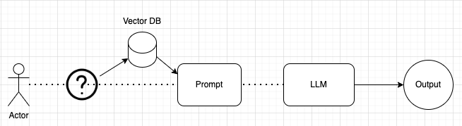
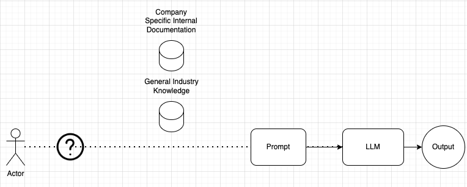
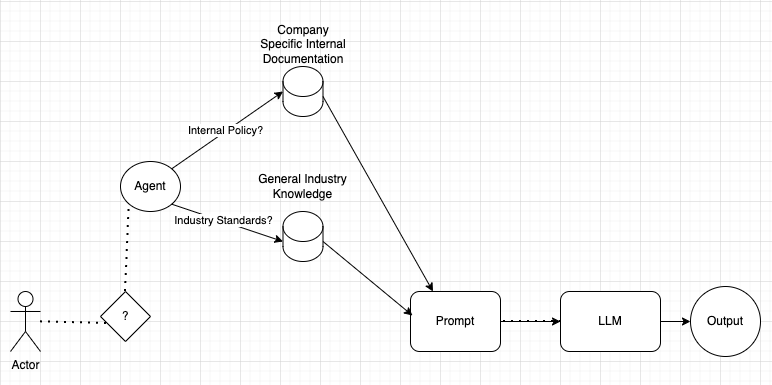
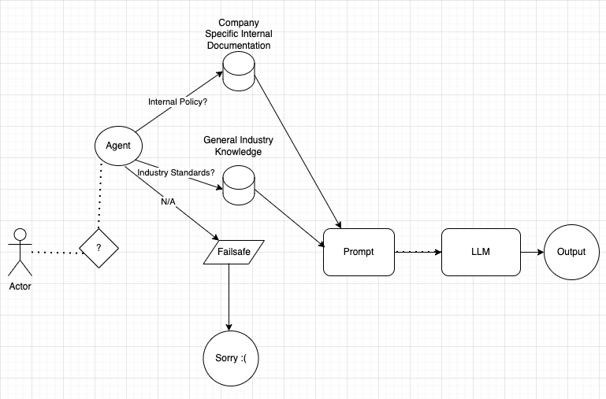

### Agentic RAG Lightboard

A quick refresher on what Retrieval-Augemented Generation is:

Retrieval-Augmented Generation (RAG) is a powerful and popular pipeline that enhances responses from a Large Language Model (an LLM). It does this by incorporating relevant data retrieved from a vector database adding it as context to the prompt and sending it to the LLM for generation. What this does, is allows the LLM to ground its response in concrete and accurate information, and that improves the quality and reliability of the response.

(I will quickly sketch this out to explain)

A user makes a query, which is then sent to our vector database, and the result from the db is added as context to the prompt, which is sent to the LLM to generate a response.

In a typical RAG pipeline, we call the LLM once and use it solely to generate a response. But what if we could leverage the LLM not just for responses but also for additional tasks—like deciding which vector database to query if we have multiple databases, or determining the type of response to give? Should it answer with text, generate a chart, or even provide a code snippet—all depending on the context of the query?

This is where the Agentic RAG pipeline comes into play. In Agentic RAG, we use the LLM as an ***agent***, and the LLM goes beyond just generating a response. It takes on an active role, and can make decisions that will improve both the relevance and accuracy of the retrieved data.

Let’s revisit our initial RAG pipeline example, but this time, let’s introduce an agent into the mix. In the initial RAG pipeline, we simply retrieved data from a single source and used it to augment the LLM’s output. Now, let’s explore how we can augment that initial process with an Agent and a couple of different sources of data.

Imagine we have two vector databases:

One for storing internal company documentation - things like policies, procedures, and guidelines

Another containing general industry knowledge - best practices, industry standards, and public resources.

So how can we get the LLM to use the vector db that contains the data that will be most relevant to the query?

Lets add an agent into this pipeline. Now it can intelligently decide which database to query based on the user's question. The agent isn't making a random guess; it's leveraging the LLM's language understanding capabilities to interpret the query and determine its context.

So, if an employee asks, “What is the company’s policy on remote work during the holidays?” the agent directs this question to the internal company database.

But if the question is more general, like “What are the industry standards for remote work in tech companies?” the agent queries the industry knowledge database.

Powered by an LLM and properly trained, the agent analyzes the query and, based on its understanding of the content and context, decides which database to use.

And let's say the query is totally out of left field and has nothing to do with the data in either of our vector databases. We can have a failsafe. So if the query is something like "Who won the world series in 2015?" the agent can route to a canned response saying, "Sorry, I do not have the information you are looking for."

This Agentic RAG pipeline can be used in customer support systems and legal tech, where a lawyer can source answers to their questions from internal briefs in one query and public case law databases in another.

The agent can be utilized in a ton of ways. Agentic RAG is an evolution in how we enhance the RAG pipeline by moving beyond simple response generation to more intelligent decision-making. By allowing an agent to choose the best data sources and potentially even incorporate external information—like real-time data or third-party services, we create a pipeline that's more responsive, accurate, and adaptable. This approach opens up so many possibilities for applications in customer service, legal tech, healthcare, and virtually any field. As the technology continues to evolve, we will see AI systems that truly understand context and can deliver amazing value to end-users.
